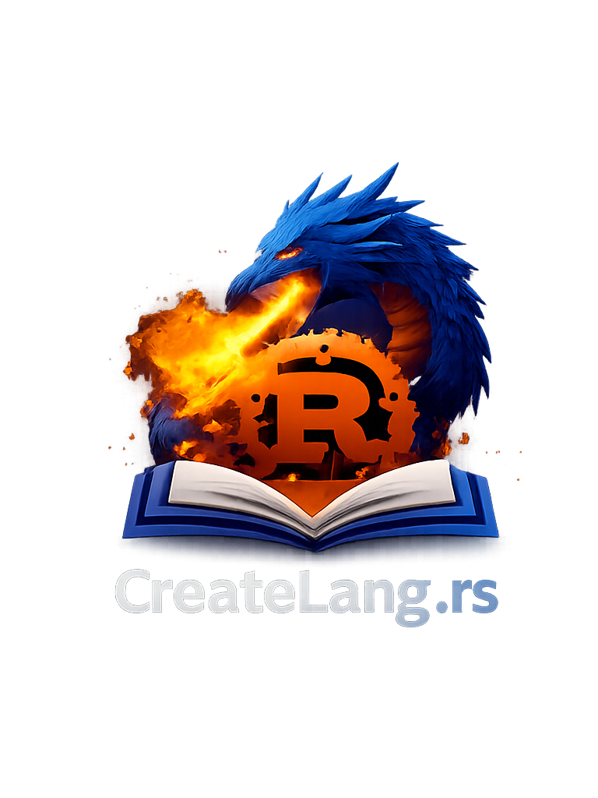

<p align="center">
  <picture>
    <source media="(prefers-color-scheme: dark)" srcset="book/src/img/logo_dark_mode.png">
    <source media="(prefers-color-scheme: light)" srcset="book/src/img/logo_light_mode.png">
    
  </picture>
</p>

<p align="center">
  <h1 align="center">Create Your Own Programming Language with Rust</h1>
</p>

<p align="center">
  <h3 align="center">Learn compiler fundamentals by building four languages from scratch</h3>
</p>

<p align="center">
  <a href="#overview"><strong>Overview</strong></a> &bull;
  <a href="#languages"><strong>Languages</strong></a> &bull;
  <a href="#quick-start"><strong>Quick Start</strong></a> &bull;
  <a href="#requirements"><strong>Requirements</strong></a> &bull;
  <a href="#building-the-book"><strong>Book</strong></a>
</p>

<p align="center">
  <a href="https://github.com/ehsanmok/create-your-own-lang-with-rust/actions/workflows/ci.yml">
    
  </a>
  <a href="https://github.com/ehsanmok/create-your-own-lang-with-rust/actions/workflows/gh-pages.yml">
    
  </a>
  <a href="https://createlang.rs">
    
  </a>
  <a href="https://github.com/ehsanmok/create-your-own-lang-with-rust/blob/master/LICENSE">
    
  </a>
</p>

---

<p align="center">
  <strong>Edition 1.0 Complete</strong><br>
  Four languages covering interpretation, compilation, type systems, and object-oriented programming.<br>
  LLVM code generation, JIT compilation, type inference, and memory management.
</p>

---

## Overview

This book arose from frustration with the lack of modern, clear, and concise teaching materials for beginners who want to learn how to create their own programming language.

> *"If you don't know how compilers work, then you don't know how computers work"* <sup>[1](http://steve-yegge.blogspot.com/2007/06/rich-programmer-food.html)</sup>

> *"If you can't explain something in simple terms, you don't understand it"* <sup>[2](https://skeptics.stackexchange.com/questions/8742/did-einstein-say-if-you-cant-explain-it-simply-you-dont-understand-it-well-en)</sup>

## Languages

The book teaches programming language implementation through four progressively complex languages:

| Language | Type System | Execution | Features | Rust Version |
|----------|-------------|-----------|----------|--------------|
| **Calculator** | None | Interpreter/VM/JIT | Arithmetic expressions | stable / nightly |
| **Firstlang** | Dynamic | Interpreter | Variables, functions, recursion | stable 1.70+ |
| **Secondlang** | Static | LLVM JIT | Type inference, compilation | nightly + LLVM |
| **Thirdlang** | Static | LLVM JIT | Classes, methods, OOP | nightly + LLVM |

```
create-your-own-lang-with-rust/
├── calculator/     # Simple arithmetic (interpreter, VM, JIT backends)
├── firstlang/      # Interpreted language with recursion
├── secondlang/     # Compiled language with type inference
├── thirdlang/      # Object-oriented with classes and methods
└── book/           # mdbook source for createlang.rs
```

Each language has its own README with detailed instructions.

## Quick Start

### Firstlang (stable Rust)

```bash
cd firstlang
cargo run -- examples/fibonacci.fl    # Run a program
cargo run                              # Start REPL
```

### Secondlang (nightly + LLVM)

```bash
cd secondlang
rustup run nightly cargo run -- examples/fibonacci.sl
rustup run nightly cargo run -- --ir examples/fibonacci.sl   # View LLVM IR
```

### Thirdlang (nightly + LLVM)

```bash
cd thirdlang
rustup run nightly cargo run --bin thirdlang -- examples/point.tl
rustup run nightly cargo run --bin thirdlang -- examples/counter.tl
```

### Calculator

```bash
cd calculator
cargo run --bin main examples/simple.calc                              # Interpreter
cargo run --bin main --features vm examples/simple.calc                # VM
rustup run nightly cargo run --bin main --features jit examples/simple.calc  # JIT
```

## Requirements

### Stable Rust (Calculator interpreter/VM, Firstlang)

```bash
curl --proto '=https' --tlsv1.2 -sSf https://sh.rustup.rs | sh
```

### Nightly Rust + LLVM (Calculator JIT, Secondlang, Thirdlang)

```bash
# Install nightly
rustup toolchain install nightly

# Install LLVM
# macOS:
brew install llvm

# Debian/Ubuntu:
# See https://apt.llvm.org/
```

Check your LLVM version and update `Cargo.toml` accordingly:

| LLVM Version | inkwell feature |
|--------------|-----------------|
| 20.x | `llvm20-1` |
| 19.x | `llvm19-1` |
| 18.x | `llvm18-1` |

## Running Tests

```bash
# All projects
cargo test -p calculator -p firstlang
rustup run nightly cargo test -p secondlang -p thirdlang
```

## Building the Book

```bash
cd book
mdbook serve    # Local preview at http://localhost:3000
mdbook build    # Build static site
```

---

<p align="center">
  <strong>Support</strong><br>
  If you found this project useful, please consider donating to:
</p>

<p align="center">
  <a href="https://mycf.childfoundation.org/s/donate">Child Foundation</a> &bull;
  <a href="https://blacklivesmatter.com/">Black Lives Matter</a> &bull;
  <a href="https://www.foodbankscanada.ca/">Food Bank of Canada</a>
</p>
