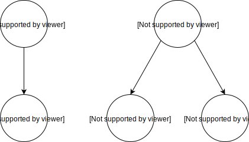

## Abstract Syntax Tree (AST)

AST comes into picture when we want to go from the string representation of our program like `"-1"` or `"1 + 2"` to something more manageable and easier to work with. Since our program is not a random string (the grammar is for), we can use the structure within the expressions `"-1"` and `"1 + 2"` to our own advantage and come up with a *new representation* like a [tree](https://en.wikipedia.org/wiki/Tree_structure)

<p align="center">
  </br>
    <a href> </a>
</p>

One thing to note here is that the *kinds* of the nodes in our tree are not the same i.e. `+` node is different from `1` node. In fact, `+` has an **Operator** type and `1` is an integer **Int** type


<p align="center">
  </br>
    <a href> </a>
</p>


so we define our AST nodes as

```rust
pub enum Operator {
    Plus,
    Minus,
}

pub enum Node {
    Int(i32),
}
```

Referring back to our grammar, we actually have different kinds of *recursive* expressions;

* **unary** grammar
  ```
  UnaryExpr = { Operator ~ Term }
  ```
* **binary** grammar
  ```
  BinaryExpr = { Term ~ (Operator ~ Term)* }
  ```

So for example, the expression `"-1 + (2 + 3)"` has this recursive structure

<p align="center">
</br>
    <a href> </a>
</p>

To include those into our AST to make it an actual [tree data structure](https://en.wikipedia.org/wiki/Binary_tree),
we complete our AST definition as follows


```rust
{{#include ../../../calculator/src/ast.rs:operator}}

{{#include ../../../calculator/src/ast.rs:node}}
```
<span class="filename">Filename: calculator/src/ast.rs</span>

Now, we can use the `pest` generated `CalcParser::parse` to map the Rules of our `Calc` language string to our AST.

```rust,ignore

{{#include ../../../calculator/src/parser.rs:parse_source}}
```
Checkout [calculator/src/parser.rs](https://github.com/ehsanmok/create-your-own-lang-with-rust/blob/master/calculator/src/parser.rs).


Note that `CalcParser::parse` takes care of the AST traversal and correctly maps it to `Vec<Node>` for easier access
in later stages of compilation.


## Interpreter

CPU is the *ultimate interpreter*. That is, it executes opcodes as it goes. To do that, after we have changed the representation (aka *lowered* the representation) of our source code `&str` to AST `Node`, a basic interpreter looks at each node of the AST (via any [tree traversal methods](https://en.wikipedia.org/wiki/Tree_traversal)) and simply **evaluates** it *recursively*

```rust,ignore
{{#include ../../../calculator/src/compiler/interpreter.rs:interpreter_eval}}
```

To sum up, we define a `Compile` trait that we will use throughout this chapter

```rust,ignore
{{#include ../../../calculator/src/lib.rs:compile_trait}}
```

and we can now implement our interpreter

```rust,ignore
{{#include ../../../calculator/src/compiler/interpreter.rs:interpreter}}
```
<span class="filename">Filename: calculator/src/compiler/interpreter.rs</span>

and test

```rust,ignore
assert_eq!(Interpreter::from_source("1 + 2").unwrap(), 3);
```

Run such tests locally with

```text
cargo test interpreter --tests
```
