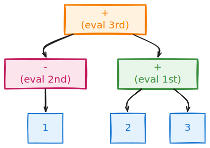

## Abstract Syntax Tree (AST)

> Think of source code as a *sentence* and the AST as its *diagram*. Just like "The cat sat on the mat" can be diagrammed into subject/verb/object, `1 + 2` can be diagrammed into left/operator/right. The AST is that diagram - it captures *structure*, not just text.

We've parsed our source code into pest's representation. But pest gives us a generic tree of "pairs" - it doesn't know that `+` means addition or that `1` is a number we want to compute with. We need our own data structure that captures *meaning*, not just syntax.

## From String to Tree

AST comes into the picture when we want to go from the string representation of our program like `"-1"` or `"1 + 2"` to something more manageable. Since our program is not a random string (that's what the grammar ensures), we can use its structure to our advantage.

Here's what `1 + 2` looks like as a tree:

<p align="center">
  </br>
    <a href> </a>
</p>

Notice something important: the nodes in our tree are *different kinds* of things. The `+` node is an **operator** - it tells us what to do. The `1` and `2` nodes are **values** - they're the things we operate on.

<p align="center">
  </br>
    <a href> </a>
</p>

## Defining the AST in Rust

In Rust, we represent "different kinds of things" with enums. Let's start simple:

```rust,ignore
pub enum Operator {
    Plus,
    Minus,
}

pub enum Node {
    Int(i32),
}
```

This says: an `Operator` is either `Plus` or `Minus`. A `Node` is an integer that holds an `i32` value.

But wait - this only handles numbers! What about expressions like `1 + 2`? We need nodes that can contain other nodes.

## Recursive Expressions

Looking back at our grammar, we have two recursive patterns:

**Unary expressions** - An operator applied to one thing:

```
UnaryExpr = { Operator ~ Term }
```

This handles `-1` (minus applied to 1) or `-(2 + 3)` (minus applied to a whole expression).

**Binary expressions** - An operator between two things:

```
BinaryExpr = { Term ~ (Operator ~ Term)* }
```

This handles `1 + 2` (plus between 1 and 2) or `1 + 2 + 3` (chained additions).

Here's a complex example: `"-1 + (2 + 3)"` forms this tree:

<p align="center">
</br>
    <a href> </a>
</p>

See how it's nested? The outer `+` has children, and one child is itself a `+` expression. Trees let us represent this nesting naturally.

## The Complete AST

Now we can define our full AST:

```rust,ignore
{{#include ../../../calculator/src/ast.rs:operator}}

{{#include ../../../calculator/src/ast.rs:node}}
```

<a class="filename" href="https://github.com/ehsanmok/create-your-own-lang-with-rust/blob/master/calculator/src/ast.rs">calculator/src/ast.rs</a>

Let's understand each variant:

- **`Int(i32)`** - A literal number like `42` or `-7`
- **`UnaryExpr { op, child }`** - An operator with one operand, like `-5`. The `child` is another `Node`, which is how we handle `-(-5)`.
- **`BinaryExpr { op, lhs, rhs }`** - An operator with two operands (left-hand side, right-hand side). The `lhs` and `rhs` are `Node`s, so we can nest: `(1 + 2) + 3`.

The `Box<Node>` is Rust's way of saying "this field contains another node, stored on the heap." Without `Box`, Rust couldn't calculate the size of `Node` (it would be infinite - a Node containing a Node containing a Node...).

## Building the AST from pest

Now we connect pest's output to our AST. The `parse_source` function walks through pest's pairs and constructs our `Node` tree:

```rust,ignore

{{#include ../../../calculator/src/parser.rs:parse_source}}
```

This function is doing something subtle: it's *translating* between two representations. pest says "I found a `BinaryExpr` rule with these children." We say "Great, make a `BinaryExpr` node with this operator and these operands."

Checkout [calculator/src/parser.rs](https://github.com/ehsanmok/create-your-own-lang-with-rust/blob/master/calculator/src/parser.rs) for the full implementation.

The result is a `Vec<Node>` - a list of AST nodes ready for the next stage.

## Interpreter

Now comes the payoff. We have a tree representing our program. How do we actually *compute* the result?

The CPU is the *ultimate interpreter* - it executes opcodes one at a time. Our interpreter does the same thing at a higher level: it walks the tree and evaluates each node.

The core insight is **recursion**. To evaluate `1 + 2`:

1. Evaluate the left side (`1`) → get `1`
2. Evaluate the right side (`2`) → get `2`
3. Apply the operator (`+`) → get `3`

If the left side were `(3 + 4)` instead of `1`, we'd recursively evaluate that first. This is why trees are so powerful - the structure tells us the order of operations.

Here's the evaluation function:

```rust,ignore
{{#include ../../../calculator/src/compiler/interpreter.rs:interpreter_eval}}
```

Read this carefully. For each node type:

- **Int** - Just return the value. Nothing to compute.
- **UnaryExpr** - Recursively evaluate the child, then apply the operator (negate for minus).
- **BinaryExpr** - Recursively evaluate both sides, then combine with the operator.

The recursion handles arbitrary nesting automatically. `1 + 2 + 3 + 4`? No problem - the tree structure determines the order, and each call handles one level.

## Putting It Together

We define a `Compile` trait so all our backends (interpreter, VM, JIT) share the same interface:

```rust,ignore
{{#include ../../../calculator/src/lib.rs:compile_trait}}
```

And implement our interpreter:

```rust,ignore
{{#include ../../../calculator/src/compiler/interpreter.rs:interpreter}}
```

<a class="filename" href="https://github.com/ehsanmok/create-your-own-lang-with-rust/blob/master/calculator/src/compiler/interpreter.rs">calculator/src/compiler/interpreter.rs</a>

Now we can test it:

```rust,ignore
assert_eq!(Interpreter::from_source("1 + 2").unwrap(), 3);
```

Run tests locally with:

```bash
cargo test interpreter --tests
```

## Why This Pattern Matters

The pattern we just learned - parse to AST, recursively evaluate - is the foundation of *every* interpreter. Python, Ruby, JavaScript interpreters all do this (with more node types, of course).

In the next sections, we'll see two other ways to execute the same AST:

- **JIT compilation** - Convert the AST to machine code, then run it
- **Bytecode VM** - Convert to simpler instructions, then interpret those

Same AST, three different backends. That's the power of separating parsing from execution.

<div class="checkpoint">

At this point, you should be able to:

- Parse `1 + 2` and build an AST with a `BinaryExpr` node
- Evaluate `1 + 2 - 3` and get `0`
- Handle nested expressions like `-1 + (2 + 3)`

</div>

<div class="related-topics">
<strong>Related Topics</strong>

- [Grammar and Parser](./grammar_lexer_parser.md) - How input becomes tokens
- [JIT Compilation](./jit_intro.md) - Compile AST to machine code
- [Virtual Machine](./vm.md) - Compile AST to bytecode
- [Firstlang AST](../02_firstlang/functions.md) - AST for a full language

</div>
