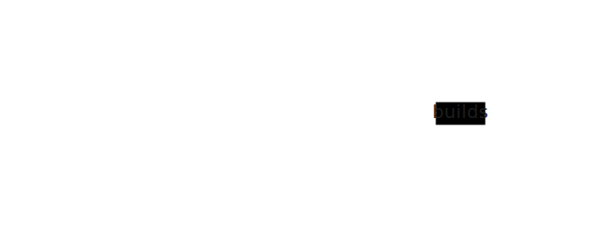

## Grammar-Lexer-Parser Pipeline

Before we can execute code, we need to understand it. A compiler's first job is to transform messy text into something structured. Here's how that happens:

<p align="center">
</br>
    <a href> </a>
</p>

Let's walk through this pipeline with a simple example. Say the user types `1 + 2`:

1. **Grammar** - The rules that define what valid code looks like. Our grammar says "an expression can be a number, or two numbers with an operator between them." The string `1 + 2` matches this pattern. The string `+ + 1` doesn't.

2. **Lexer (Tokenizer)** - Breaks the text into meaningful chunks. `"1 + 2"` becomes three tokens: `[1, +, 2]`. The lexer also tracks where each token appears in the source code, which helps with error messages later.

3. **Parser** - Builds a tree structure from the tokens. `[1, +, 2]` becomes a tree with `+` at the top and `1` and `2` as children. This tree is the **Abstract Syntax Tree (AST)**.

## Grammar

While there are many ways to define a grammar (regular expressions, context-free grammars, etc.), we'll use **[Parsing Expression Grammar (PEG)](https://en.wikipedia.org/wiki/Parsing_expression_grammar)**. PEG grammars are easy to read and reason about.

Here's the complete grammar for our calculator:

```text
{{ #include ../../../calculator/src/grammar.pest }}
```

<a class="filename" href="https://github.com/ehsanmok/create-your-own-lang-with-rust/blob/master/calculator/src/grammar.pest">calculator/src/grammar.pest</a>

Don't let this overwhelm you - let's break it down line by line:

**`Program = _{ SOI ~ Expr ~ EOF }`** - A program is an expression, surrounded by "start of input" (`SOI`) and "end of file" (`EOF`). The `_{ }` means we don't create a node for `Program` itself - it's just a wrapper.

**`Expr = { UnaryExpr | BinaryExpr | Term }`** - An expression is either unary (`-1`), binary (`1 + 2`), or a simple term (just a number). The `|` means "or" - try each alternative in order.

**`Term = { Int | "(" ~ Expr ~ ")" }`** - A term is either a number or a parenthesized expression. This is how we handle `(1 + 2) * 3` - the parenthesized part becomes a single term.

**`UnaryExpr = { Operator ~ Term }`** - A unary expression is an operator followed by a term, like `-1` or `+5`.

**`BinaryExpr = { (UnaryExpr | Term) ~ (Operator ~ Term)+ }`** - A binary expression is something followed by one or more operator-term pairs. This handles `1 + 2`, `1 + 2 + 3`, and even `-1 + 2` (unary expression followed by operator-term).

**`Operator = { "+" | "-" }`** - Our operators are just plus and minus for now.

**`Int = @{ ASCII_DIGIT+ }`** - An integer is one or more digits. The `@` makes it "atomic" - no whitespace inside.

**`WHITESPACE = _{ " " | "\t" | "\r" | "\n" }`** - pest automatically skips these between tokens, so `1+2` and `1 + 2` both work.

## From Grammar to Parser

We use **[pest](https://pest.rs/)** to turn this grammar into a working parser. The magic happens with a derive macro:

```rust,ignore
{{#include ../../../calculator/src/parser.rs:parser}}
```

<a class="filename" href="https://github.com/ehsanmok/create-your-own-lang-with-rust/blob/master/calculator/src/parser.rs">calculator/src/parser.rs</a>

That's it! This one annotation tells Rust: "Read `grammar.pest`, generate a parser that recognizes our language, and call it `CalcParser`."

pest does all the heavy lifting - tokenizing, tracking positions, handling whitespace. We just write the grammar and get a working parser.

To use it:

```rust,ignore
CalcParser::parse(Rule::Program, source)
```

This returns a tree of "pairs" - pest's way of representing matched rules. In the [next section](./ast.md), we'll convert these pairs into our own AST structure, which is easier to work with.

## Why This Matters

You might wonder: why not just use regular expressions? For a simple calculator, you probably could. But as languages get more complex (nested expressions, functions, classes), grammars scale and regexes don't.

The grammar is also your language's specification. When someone asks "is `--1` valid?", you look at the grammar. When you add a new feature, you extend the grammar. It's the single source of truth for what your language accepts.

Before doing that, we need to define our Abstract Syntax Tree (AST) in the [next section](./ast.md).
