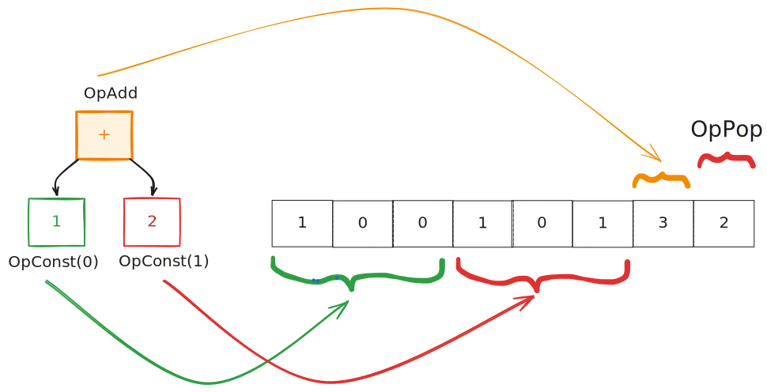

## Virtual Machine

We've seen two ways to execute code: interpret the AST directly, or JIT compile to native machine code. There's a third approach that sits in between: **compile to bytecode, then interpret that**.

Why would we do this?

- **Simpler than JIT** - No LLVM dependency, works everywhere
- **Faster than AST interpretation** - Bytecode is more compact and cache-friendly
- **Portable** - Same bytecode runs on any machine with our VM

This is how Python, Java, Ruby, and many other languages work. You compile source code to bytecode once, then run the bytecode interpreter wherever you need it.

### What Is Bytecode?

Think of bytecode as a *simplified assembly language* designed for our VM. Real assembly has hundreds of instructions. Our bytecode has just four:

| Opcode | What it does |
|--------|--------------|
| `OpConstant(index)` | Push a constant onto the stack |
| `OpAdd` | Pop two values, push their sum |
| `OpSub` | Pop two values, push their difference |
| `OpPop` | Pop and discard the top value |

That's it! With just these four operations, we can evaluate any arithmetic expression.

## Step 1: Define Opcodes

We represent opcodes as bytes. This makes bytecode compact and fast to decode:

```rust,ignore
{{#include ../../../calculator/src/compiler/vm/opcode.rs:vm_opcode}}
```

<a class="filename" href="https://github.com/ehsanmok/create-your-own-lang-with-rust/blob/master/calculator/src/compiler/vm/opcode.rs">calculator/src/compiler/vm/opcode.rs</a>

Each opcode is assigned a unique byte value. When the VM sees `0x03`, it knows to add. When it sees `0x01`, it knows to load a constant.

We also need a way to construct these bytes:

```rust,ignore
{{#include ../../../calculator/src/compiler/vm/opcode.rs:vm_make_op}}
```

`OpConstant` is special - it takes an *argument* (which constant to load). We encode this as two bytes following the opcode, giving us up to 65,536 constants.

## Step 2: Define Bytecode Structure

Our bytecode consists of two parts:

```rust,ignore
{{#include ../../../calculator/src/compiler/vm/bytecode.rs:bytecode}}
```

<a class="filename" href="https://github.com/ehsanmok/create-your-own-lang-with-rust/blob/master/calculator/src/compiler/vm/bytecode.rs">calculator/src/compiler/vm/bytecode.rs</a>

- **`instructions`** - A flat array of bytes. Opcodes and their arguments, all mixed together.
- **`constants`** - A table of literal values. Instead of encoding `42` in the instruction stream, we store it in the constants table and reference it by index.

### Example: Compiling `1 + 2`

Let's trace through what happens when we compile `1 + 2`:

<p align="center">
</br>
    <a href> </a>
</p>

The AST has three nodes: `Int(1)`, `Int(2)`, and `BinaryExpr(+)`. We walk the tree and emit bytecode:

1. **Visit `1`** - Add `Int(1)` to constants table (index 0). Emit `OpConstant(0)`.
2. **Visit `2`** - Add `Int(2)` to constants table (index 1). Emit `OpConstant(1)`.
3. **Visit `+`** - Emit `OpAdd`.
4. **Done** - Emit `OpPop` to clean up.

The result:

```rust,ignore
ByteCode {
    instructions: [1, 0, 0, 1, 0, 1, 3, 2],
    //             ^-----^  ^-----^  ^  ^
    //             OpConstant(0)  OpAdd  OpPop
    //                    OpConstant(1)
    constants: [Int(1), Int(2)]
}
```

Let's decode those bytes:

- `[1, 0, 0]` = OpConstant with index 0 (two bytes: 0x00, 0x00)
- `[1, 0, 1]` = OpConstant with index 1
- `[3]` = OpAdd
- `[2]` = OpPop

Now we implement the compiler that generates this bytecode:

```rust,ignore
{{#include ../../../calculator/src/compiler/vm/bytecode.rs:bytecode_interpreter}}
```

<a class="filename" href="https://github.com/ehsanmok/create-your-own-lang-with-rust/blob/master/calculator/src/compiler/vm/bytecode.rs">calculator/src/compiler/vm/bytecode.rs</a>

Notice how similar this is to the AST interpreter - we still recurse through the tree. The difference is that instead of *computing* results, we *emit* instructions.

## Step 3: The Virtual Machine

Now we need a machine to execute our bytecode. Our VM is a **stack machine** - it keeps intermediate values on a stack.

Here's the structure:

```rust,ignore
{{#include ../../../calculator/src/compiler/vm/vm.rs:vm}}
```

- **`bytecode`** - The program to execute
- **`stack`** - Where we store intermediate values (a fixed-size array for speed)
- **`sp`** - Stack pointer: points to the next free slot

### How Execution Works

The VM reads instructions left-to-right with an **instruction pointer (IP)**. For `1 + 2`, it processes `OpConstant(0)` (push 1), `OpConstant(1)` (push 2), `OpAdd` (pop both, push 3), and `OpPop` (return 3). Each opcode manipulates the stack accordingly.

Here's the execution loop:

```rust,ignore
{{#include ../../../calculator/src/compiler/vm/vm.rs:vm_interpreter}}
```

<a class="filename" href="https://github.com/ehsanmok/create-your-own-lang-with-rust/blob/master/calculator/src/compiler/vm/vm.rs">calculator/src/compiler/vm/vm.rs</a>

This is a **fetch-decode-execute** loop:

1. **Fetch** - Read the next byte (`self.bytecode.instructions[ip]`)
2. **Decode** - Match on the opcode to determine what operation to perform
3. **Execute** - Manipulate the stack accordingly
4. **Repeat** - Increment IP and continue until we're out of instructions

### Why Stacks?

You might wonder: why use a stack? Why not just have named variables?

Stacks are elegant because they handle *any* nesting automatically. For `(1 + 2) * (3 + 4)`, we first compute `1 + 2 = 3` (leaving 3 on the stack), then `3 + 4 = 7` (now stack has `[3, 7]`), then multiply to get 21. Each operation just pops its inputs and pushes its output. The stack naturally tracks what's "in progress."

## Running the VM

To compile and run code through our VM:

```rust,ignore
let byte_code = Interpreter::from_source(source);
println!("byte code: {:?}", byte_code);
let mut vm = VM::new(byte_code);
vm.run();
println!("{}", vm.pop_last());
```

Run tests locally:

```bash
cargo test vm --tests --features vm
```

## Trade-offs: VM vs JIT vs Interpreter

| Approach | Startup | Execution | Complexity | Portability |
|----------|---------|-----------|------------|-------------|
| AST Interpreter | Fast | Slow | Simple | Everywhere |
| Bytecode VM | Medium | Medium | Medium | Everywhere |
| JIT (LLVM) | Slow | Fast | Complex | LLVM platforms |

The VM hits a sweet spot for many use cases. It's why Python and Ruby use bytecode VMs - fast enough for most code, simple enough to implement everywhere.

Checkout the [next section](./repl.md) to see how to create a REPL for our `Calc` to compare different compilation paths interactively.
