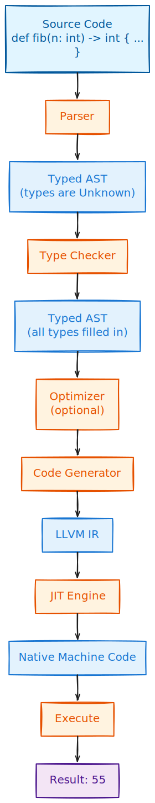

# JIT Compiling Fibonacci

We have built all the pieces. Now let us put them together and run some real programs.

## The Complete Pipeline

Here is what happens when you run a Secondlang program:

<p align="center">
</br>
    <a href> </a>
</p>

Each step transforms the program into a different representation, getting closer and closer to something the CPU can execute.

## Running Fibonacci

Create a file `examples/fibonacci.sl`:

```rust,ignore
def fib(n: int) -> int {
    if (n < 2) {
        return n
    } else {
        return fib(n - 1) + fib(n - 2)
    }
}

fib(10)
```

Run it:

```bash
cd secondlang
rustup run nightly cargo run -- examples/fibonacci.sl
```

Output:

```
55
```

It works. We just JIT compiled recursive Fibonacci to native code and ran it.

## Viewing the Generated IR

Want to see what LLVM IR your program compiles to?

```bash
rustup run nightly cargo run -- --ir examples/fibonacci.sl
```

You will see something like:

```
; ModuleID = 'secondlang'
source_filename = "secondlang"

define i64 @fib(i64 %n) {
entry:
  %n1 = alloca i64, align 8
  store i64 %n, ptr %n1, align 4
  %n2 = load i64, ptr %n1, align 4
  %lt = icmp slt i64 %n2, 2
  %ext = zext i1 %lt to i64
  %cond = trunc i64 %ext to i1
  br i1 %cond, label %then, label %else

then:
  %n3 = load i64, ptr %n1, align 4
  ret i64 %n3

else:
  %n4 = load i64, ptr %n1, align 4
  %sub = sub i64 %n4, 1
  %call = call i64 @fib(i64 %sub)
  %n5 = load i64, ptr %n1, align 4
  %sub6 = sub i64 %n5, 2
  %call7 = call i64 @fib(i64 %sub6)
  %add = add i64 %call, %call7
  ret i64 %add
}

define i64 @__main() {
entry:
  %call = call i64 @fib(i64 10)
  ret i64 %call
}
```

You can see:

- The `@fib` function with its recursion
- The `@__main` wrapper that calls `fib(10)`
- All the loads and stores for local variables
- The branching for the if/else

## Running All Examples

Secondlang comes with several examples demonstrating different features:

### Basics with Types

```bash
rustup run nightly cargo run -- examples/basics.sl
```

Shows typed variables, functions, and control flow.

### Factorial

```rust,ignore
def factorial(n: int) -> int {
    if (n <= 1) {
        return 1
    } else {
        return n * factorial(n - 1)
    }
}

factorial(10)
```

```bash
rustup run nightly cargo run -- examples/factorial.sl
```

Expected output: `3628800`

### Type Inference Showcase

The `inference.sl` example demonstrates the compiler inferring types automatically:

```
def complex_calc(x: int) -> int {
    a = x + 1           # int (inferred from x + literal)
    b = a * a           # int (inferred from int * int)
    c = b - x           # int (inferred from int - int)
    flag = c > 100      # bool (inferred from comparison)
    if (flag) {
        return c
    } else {
        return b
    }
}

complex_calc(10)
```

```bash
rustup run nightly cargo run -- examples/inference.sl
```

Expected output: `111`

### Run All Examples

```bash
for file in examples/*.sl; do
    echo "Running $file..."
    rustup run nightly cargo run -- "$file"
done
```

## Running Tests

Secondlang has comprehensive integration tests covering all compiler stages:

- **Parsing**: Grammar validation
- **Type Checking**: Type inference and error detection
- **Code Generation**: LLVM IR generation
- **JIT Execution**: Running compiled code

Run all tests:

```bash
rustup run nightly cargo test
```

Run a specific test:

```bash
rustup run nightly cargo test test_jit_fibonacci
```

Run tests with verbose output:

```bash
rustup run nightly cargo test -- --nocapture
```

The tests are in `tests/integration_tests.rs` and cover:

- Arithmetic operations
- Conditionals and loops
- Recursion (Fibonacci, factorial, GCD)
- Type inference
- Type errors (caught at compile time)
- Function calls

## What We Built

Let us step back and appreciate what we have accomplished. Starting from scratch, we built:

1. **A parser** using PEG grammar (pest) - turns source code into AST (see [Type Annotations](./annotations.md))
2. **A type system** with inference - catches errors at compile time (see [Type Inference](./inference.md))
3. **Optimization passes** using the visitor pattern - simplifies the AST (see [AST Optimizations](./optimizations.md))
4. **An LLVM code generator** (inkwell) - produces IR from the typed AST (see [Code Generation](./codegen.md))
5. **JIT compilation** - compiles IR to native code and runs it (see [From AST to IR](./ir.md))

All in about 1500 lines of Rust.

## Comparing the Languages

See how we progressed through each language:

| Feature | [Calculator](../01_calculator/calc_intro.md) | [Firstlang](../02_firstlang/intro.md) | Secondlang |
|---------|------------|-----------|------------|
| Grammar | 18 lines | 70 lines | 77 lines |
| Type System | None | Dynamic | Static |
| Type Annotations | None | None | `x: int`, `-> int` |
| Functions | No | Yes | Yes |
| Recursion | No | Yes | Yes |
| Execution | Interpreter/VM/JIT | Tree-walking interpreter | LLVM JIT |

The progression is clear:

1. **[Calculator](../01_calculator/calc_intro.md)** - Learn the basics with the simplest possible language
2. **[Firstlang](../02_firstlang/intro.md)** - Add programming constructs, understand interpretation
3. **Secondlang** - Add types, understand compilation

## What's Next: Thirdlang

Ready for more? In **[Part IV: Thirdlang](../04_thirdlang/intro.md)**, we add **object-oriented programming**:

- **Classes** - User-defined types with fields and methods
- **Objects** - Heap-allocated instances
- **Constructors/Destructors** - `__init__` and `__del__`
- **Memory Management** - `new` and `delete`

Thirdlang builds directly on what you learned here. The type system extends to support class types, and the code generator adds LLVM struct types and malloc/free.

Continue to **[Thirdlang: Adding Classes and Objects](../04_thirdlang/intro.md)** →
