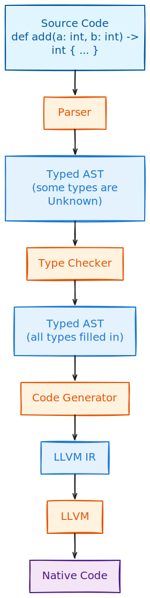

# Why Types Matter

Before we start adding types to our language, let us take a moment to understand *why* we would want types in the first place. After all, [Firstlang](../02_firstlang/intro.md) works just fine without them.

## The Problem: Runtime Surprises

In Firstlang, we can write code like this:

```
def add(a, b) {
    return a + b
}

add(1, 2)      # works fine, returns 3
add(10, 20)    # works fine, returns 30
add(1, true)   # crashes at runtime!
```

The third call `add(1, true)` will crash when the program runs. But here is the problem: *we do not know about this bug until we actually run the program and hit that specific line of code*.

In a small program, this might be okay. But imagine a large program with thousands of lines. The buggy code might be in a rarely-used feature. You deploy your program, and months later, a user triggers that code path and the program crashes. Not good.

## The Solution: Catch Errors Early

With types, we tell the compiler *what kind of values* each variable can hold:

```rust,ignore
def add(a: int, b: int) -> int {
    return a + b
}

add(1, true)  # Error at COMPILE time: expected int, got bool
```

Now the compiler catches the bug *before* the program even runs. We know about the problem immediately, not months later in production.

Think of types as a *contract*. When we write `a: int`, we are promising that `a` will always be an integer. The compiler checks that we keep our promises.

## Static vs Dynamic Typing

Programming languages are divided into two camps:

| Approach | When types are checked | Examples |
|----------|------------------------|----------|
| **[Static typing](https://en.wikipedia.org/wiki/Type_system#Static_type_checking)** | At compile time (before running) | Rust, C, Java, Haskell |
| **[Dynamic typing](https://en.wikipedia.org/wiki/Type_system#Dynamic_type_checking)** | At runtime (while running) | Python, JavaScript, Ruby |

Firstlang is dynamically typed. Secondlang is statically typed.

Both approaches have trade-offs:

- **Static**: Catches more bugs early, enables better performance, but requires more upfront type annotations
- **Dynamic**: More flexible, faster to prototype, but bugs can hide until runtime

## Types Enable Fast Code

There is another benefit to types: **performance**.

Consider this function:

```rust,ignore
def square(x: int) -> int {
    return x * x
}
```

The compiler knows that `x` is always a 64-bit integer. It knows the result is always a 64-bit integer. So it can generate a *single CPU instruction* for the multiplication:

```asm
imul rax, rax   ; multiply rax by itself
```

Without types, the interpreter has to do a lot of work at runtime:

1. Check what type `x` is
2. Look up the multiplication operation for that type
3. Check if the operands are compatible
4. Handle potential type errors
5. Finally, do the multiplication

All this checking adds up. A statically typed language can be 10x to 100x faster than a dynamically typed one for number-crunching tasks.

This is why [JIT compilers](https://en.wikipedia.org/wiki/Just-in-time_compilation) like V8 (JavaScript) and PyPy (Python) spend so much effort on *type speculation* - guessing what types values have so they can generate fast code.

## Our Type System

We will keep things simple. Secondlang has two basic types:

| Type | What it holds | Examples |
|------|---------------|----------|
| `int` | 64-bit signed integer | `42`, `-1`, `0` |
| `bool` | Boolean value | `true`, `false` |

These are sometimes called [primitive types](https://en.wikipedia.org/wiki/Primitive_data_type).

Functions also have types. A function's type describes what it takes in and what it produces:

```rust,ignore
def add(a: int, b: int) -> int { ... }
# Type: (int, int) -> int
# "Takes two ints, returns an int"

def isPositive(n: int) -> bool { ... }
# Type: (int) -> bool
# "Takes an int, returns a bool"
```

This notation `(int, int) -> int` is called a [function type](https://en.wikipedia.org/wiki/Function_type).

## Type Inference: The Best of Both Worlds

You might worry that adding types means writing `int` everywhere, making code verbose. But we can be smarter.

*[Type inference](https://en.wikipedia.org/wiki/Type_inference)* means the compiler figures out types when it can:

```rust,ignore
def factorial(n: int) -> int {
    result = 1        # compiler infers: result is int
    i = 1             # compiler infers: i is int
    while (i <= n) {
        result = result * i
        i = i + 1
    }
    return result
}
```

We write the types on function parameters and return values (the *boundaries*), and the compiler infers the rest. This gives us the safety of types without excessive verbosity. We cover this in detail in the [Type Inference](./inference.md) chapter.

## How Type Checking Works

Here is the high-level flow:

<p align="center">
</br>
    <a href> </a>
</p>

The [parser](https://en.wikipedia.org/wiki/Parsing) creates an [AST](https://en.wikipedia.org/wiki/Abstract_syntax_tree) where some types are marked as `Unknown` (we do not know them yet). The type checker walks through the AST, figures out all the unknown types, and checks that everything is consistent. If something is wrong (like `1 + true`), it reports an error. If everything is okay, we have a fully-typed AST ready for code generation.

## Implementation

Our type system is defined in `types.rs`:

```rust,ignore
{{#include ../../../secondlang/src/types.rs:type_enum}}
```

<a class="filename" href="https://github.com/ehsanmok/create-your-own-lang-with-rust/blob/master/secondlang/src/types.rs">secondlang/src/types.rs</a>

Let us go through each variant:

- `Int` - represents the `int` type (64-bit signed integer)
- `Bool` - represents the `bool` type (true/false)
- `Function` - represents a function type with parameter types and return type
- `Unit` - represents "no value" (like `void` in C or `()` in Rust)
- `Unknown` - a placeholder used during type inference

The `Unknown` type is the key to type inference. When we parse `x = 1 + 2`, we do not know `x`'s type yet, so we mark it as `Unknown`. The type checker later figures out it must be `Int` (because `1 + 2` produces an `Int`).

## Further Reading

- [Type system on Wikipedia](https://en.wikipedia.org/wiki/Type_system) - overview of type system concepts
- [Static vs Dynamic Typing](https://en.wikipedia.org/wiki/Type_system#Static_and_dynamic_type_checking_in_practice) - detailed comparison
- [Strong and Weak Typing](https://en.wikipedia.org/wiki/Strong_and_weak_typing) - another dimension of type systems

In the next chapter, we will see how to [add type annotations to our grammar](./annotations.md).
