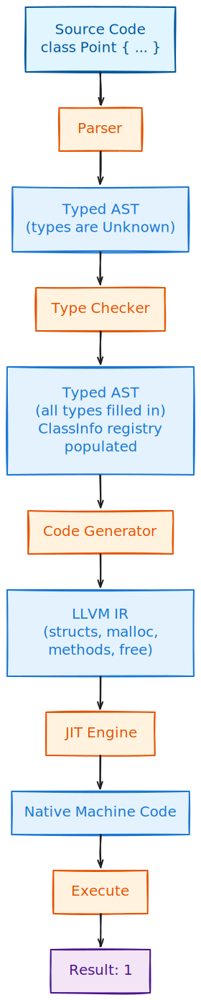

# Running Thirdlang

We have built all the pieces. Now let us put them together and run some real programs. This mirrors [JIT Compiling Fibonacci](../03_secondlang/jit_fibonacci.md) from Secondlang but with object-oriented features.

## The Complete Pipeline

Here is what happens when you run a Thirdlang program:

<p align="center">
</br>
    <a href> </a>
</p>

Each step transforms the program closer to executable code.

## Running Point Example

Create a file `examples/point.tl`:

```
class Point {
    x: int
    y: int

    def __init__(self, x: int, y: int) {
        self.x = x
        self.y = y
    }

    def distance_squared(self, other: Point) -> int {
        dx = other.x - self.x
        dy = other.y - self.y
        return dx * dx + dy * dy
    }
}

p1 = new Point(0, 0)
p2 = new Point(3, 4)
p1.distance_squared(p2)
```

Run it:

```bash
cd thirdlang
rustup run nightly cargo run --bin thirdlang -- examples/point.tl
```

Output:

```
25
```

It works! We computed the distance squared from origin `(0,0)` to point `(3,4)`, which is `3² + 4² = 25`.

## Running with Optimization

Thirdlang supports LLVM optimization passes. Compare unoptimized and optimized IR:

```bash
# Unoptimized IR (verbose, many allocas)
rustup run nightly cargo run --bin thirdlang -- --ir examples/point.tl

# Optimized IR (clean, efficient)
rustup run nightly cargo run --bin thirdlang -- --ir -O examples/point.tl
```

Run with optimization enabled:

```bash
# Default optimization (dce, mem2reg, instcombine, simplifycfg)
rustup run nightly cargo run --bin thirdlang -- -O examples/point.tl

# Custom pass pipeline
rustup run nightly cargo run --bin thirdlang -- --passes "mem2reg,dce" examples/point.tl

# LLVM's standard O2 optimization
rustup run nightly cargo run --bin thirdlang -- --passes "default<O2>" examples/point.tl
```

See [Optimizing LLVM IR](optimization.md) for details on how optimization works.

## Running Counter Example

```
class Counter {
    value: int

    def __init__(self, start: int) {
        self.value = start
    }

    def increment(self) -> int {
        self.value = self.value + 1
        return self.value
    }

    def add(self, n: int) -> int {
        self.value = self.value + n
        return self.value
    }

    def get(self) -> int {
        return self.value
    }
}

c = new Counter(10)
c.increment()    # 11
c.increment()    # 12
c.increment()    # 13
c.add(5)         # 18
c.get()          # 18 - this is the return value
```

```bash
rustup run nightly cargo run --bin thirdlang -- examples/counter.tl
```

Output:

```
18
```

## Running Destructor Example

```
class Resource {
    id: int
    status: int  # 1 = active, 0 = released

    def __init__(self, id: int) {
        self.id = id
        self.status = 1  # Mark as active
    }

    def is_active(self) -> bool {
        return self.status == 1
    }

    def __del__(self) {
        self.status = 0  # Mark as released
    }
}

r = new Resource(42)
active = r.is_active()   # true (1)
delete r                  # calls __del__, sets status = 0
active                    # returns 1 (from before delete)
```

```bash
rustup run nightly cargo run --bin thirdlang -- examples/destructor.tl
```

Output:

```
1
```

## Running All Examples

```bash
cd thirdlang

# Point: distance calculation
rustup run nightly cargo run --bin thirdlang -- examples/point.tl

# Counter: stateful object
rustup run nightly cargo run --bin thirdlang -- examples/counter.tl

# Destructor: cleanup demo
rustup run nightly cargo run --bin thirdlang -- examples/destructor.tl

# Linked node: object references
rustup run nightly cargo run --bin thirdlang -- examples/linked_node.tl
```

Or run them all:

```bash
for file in examples/*.tl; do
    echo "=== $file ==="
    rustup run nightly cargo run --bin thirdlang -q -- "$file"
done
```

## Running Tests

Thirdlang has comprehensive tests covering all stages:

```bash
# Run all tests
rustup run nightly cargo test

# Run with output
rustup run nightly cargo test -- --nocapture

# Run specific test
rustup run nightly cargo test test_jit_point_distance
```

### Test Categories

| Category | What It Tests |
|----------|---------------|
| Parsing | Class syntax, methods, new/delete |
| Type checking | Class types, method signatures, field access |
| Code generation | LLVM struct creation, method compilation |
| JIT execution | Running compiled code, getting results |

Example test:

```rust,ignore
{{#include ../../../thirdlang/tests/integration_tests.rs:test_simple_class}}
```

<a class="filename" href="https://github.com/ehsanmok/create-your-own-lang-with-rust/blob/master/thirdlang/tests/integration_tests.rs">thirdlang/tests/integration_tests.rs</a>

## What We Built

Let us step back and appreciate what we accomplished:

### Grammar (~140 lines)

- Class definitions with fields and methods
- Constructor and destructor syntax
- `new` and `delete` expressions
- Field access and method calls

### Type System (~200 lines)

- `Type::Class(name)` variant
- `ClassInfo` with fields and methods
- Method type checking
- Object type inference

### Parser (~540 lines)

- Parse classes, fields, methods
- Parse `new`, `delete`, `self`
- Parse field access, method calls
- Build typed AST

### Type Checker (~640 lines)

- Class registration
- Method resolution
- Field type checking
- Constructor/destructor validation

### Code Generator (~1050 lines)

- LLVM struct types for classes
- malloc/free integration
- Method compilation
- GEP for field access
- LLVM New Pass Manager for optimization

### Total: ~2600 lines of Rust

All in a manageable codebase that implements real object-oriented features.

## Comparing All Four Languages

| Feature | [Calculator](../01_calculator/calc_intro.md) | [Firstlang](../02_firstlang/intro.md) | [Secondlang](../03_secondlang/intro.md) | Thirdlang |
|---------|------------|-----------|------------|-----------|
| Grammar size | 18 lines | 70 lines | 77 lines | 140 lines |
| Type System | None | Dynamic | Static | Static + Classes |
| Variables | No | Yes | Yes | Yes |
| Functions | No | Yes | Yes | Yes + Methods |
| Classes | No | No | No | Yes |
| Memory | Stack | Stack | Stack | Stack + Heap |
| Execution | Interpreter/VM/JIT | Interpreter | LLVM JIT | LLVM JIT |

The progression is clear:

1. **Calculator** - Learn basics: parsing, AST, evaluation
2. **Firstlang** - Add programming: variables, functions, control flow
3. **Secondlang** - Add types: static checking, compilation
4. **Thirdlang** - Add OOP: classes, objects, memory management

## What Next?

You now have a foundation for building real languages. Ideas to explore:

### Language Features

- **Inheritance** - Virtual methods, vtables
- **Interfaces/Traits** - Polymorphism without inheritance
- **Generics** - Type parameters (`List<T>`)
- **Closures** - Functions capturing variables
- **Pattern matching** - Destructuring, exhaustive checks

### Type System

- **Nullability** - `Point?` vs `Point`
- **Reference types** - Distinguish owned vs borrowed
- **Algebraic data types** - Enums with data

### Memory Management

- **Garbage collection** - Automatic memory
- **Reference counting** - Deterministic cleanup
- **Ownership** - Rust-style borrow checking

### Code Generation

- **AOT compilation** - Compile to executables
- **Optimizations** - Inline methods, devirtualization
- **Debug info** - Source maps, breakpoints

## What's Next?

You have completed all four parts of the book. But this is just the beginning!

Continue to **[What's Next: Your Journey Starts Here](../whats_next.md)** for:

- Ideas for extending Thirdlang (inheritance, generics, closures)
- New types to add (strings, arrays, algebraic data types)
- Different execution models (AOT compilation, bytecode VMs)
- Memory management approaches (GC, reference counting, ownership)
- Tooling (debuggers, formatters, language servers)
- Recommended reading and real languages to study

The concepts you learned - grammars, ASTs, type systems, code generation - apply to any language you might build or use.

**Your journey starts here!**
