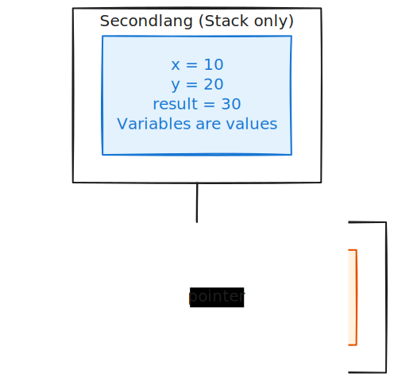

# Why Classes?

Before diving into implementation, let us understand *why* we want classes. After all, [Secondlang](../03_secondlang/intro.md) works fine with just primitive types (`int` and `bool`). If you have not read [Why Types Matter](../03_secondlang/why_types.md), that chapter explains the benefits of static typing that we build upon here.

## The Problem: Related Data Scattered

In Secondlang, we can only work with individual `int` and `bool` values:

```
# A "point" represented as separate variables
x1 = 10
y1 = 20

x2 = 30
y2 = 40

# Function takes 4 separate parameters
def distance_squared(x1: int, y1: int, x2: int, y2: int) -> int {
    dx = x2 - x1
    dy = y2 - y1
    return dx * dx + dy * dy
}

distance_squared(x1, y1, x2, y2)
```

This has problems:

1. **Easy to mix up** - What if we accidentally pass `y1` twice?
2. **No grouping** - `x1` and `y1` are related, but the language does not know that
3. **Verbose** - Every function needs all the pieces passed separately
4. **No encapsulation** - Anyone can mess with `x1` directly

## The Solution: Group Data with Classes

With classes, we bundle related data and behavior together:

```
class Point {
    x: int
    y: int

    def __init__(self, x: int, y: int) {
        self.x = x
        self.y = y
    }

    def distance_squared(self, other: Point) -> int {
        dx = other.x - self.x
        dy = other.y - self.y
        return dx * dx + dy * dy
    }
}

p1 = new Point(10, 20)
p2 = new Point(30, 40)
p1.distance_squared(p2)  # Clean and clear!
```

Now:

1. **Cannot mix up** - `p1` is one thing, `p2` is another
2. **Data is grouped** - `x` and `y` belong to a `Point`
3. **Concise** - Pass one `Point` instead of two `int`s
4. **Behavior attached** - `distance_squared` belongs to `Point`

## Object-Oriented Programming (OOP)

Classes are the foundation of [Object-Oriented Programming](https://en.wikipedia.org/wiki/Object-oriented_programming). The key concepts:

| Concept | Description | Example |
|---------|-------------|---------|
| **Class** | A blueprint for creating objects | `class Point { ... }` |
| **Object** | An instance of a class | `p = new Point(1, 2)` |
| **Field** | Data stored in an object | `self.x`, `self.y` |
| **Method** | Function attached to a class | `def distance(self)` |
| **Constructor** | Initializes a new object | `def __init__(self)` |
| **Destructor** | Cleans up before deletion | `def __del__(self)` |

## Classes as Custom Types

The key insight: **classes define new types**.

In Secondlang, we have two types: `int` and `bool`. In Thirdlang, we can create infinitely many types:

```
class Point { x: int  y: int  ... }
class Counter { count: int  ... }
class Rectangle { width: int  height: int  ... }
```

Each class name becomes a valid type:

```
def move(p: Point, dx: int, dy: int) -> Point { ... }
#         ^^^^^ Point is now a type!
```

This is called a **[nominal type system](https://en.wikipedia.org/wiki/Nominal_type_system)** - types are identified by their names.

## Memory Model: Stack vs Heap

Here is where things get interesting. In Secondlang, everything lives on the **stack**. With classes, objects live on the **heap**, and variables hold **pointers** to them:

<p align="center">
</br>
    <a href> </a>
</p>

This has implications:

1. **Creation** - `new Point(...)` allocates memory on the heap
2. **Access** - `p.x` follows the pointer to read the field
3. **Deletion** - `delete p` frees the heap memory
4. **Sharing** - Multiple variables can point to the same object

## Why Not Garbage Collection?

Many languages (Java, Python, Go) use **[garbage collection](https://en.wikipedia.org/wiki/Garbage_collection_(computer_science))** - automatically freeing memory when objects are no longer used.

We use **explicit memory management** instead:

```
p = new Point(1, 2)   # Allocate
# ... use p ...
delete p              # Free (programmer's job)
```

Why? For learning purposes:

1. **Understand the machine** - See how memory really works
2. **Appreciate GC** - Understand what garbage collectors do for you
3. **Simpler to implement** - No need for reference counting or tracing
4. **Like C++** - Many real languages work this way

The downside: forget to `delete` and you have a **[memory leak](https://en.wikipedia.org/wiki/Memory_leak)**. Delete twice and you have **[undefined behavior](https://en.wikipedia.org/wiki/Undefined_behavior)**. Real programs need to be careful!

## Our OOP Design

We implement a subset of OOP. Here is what we include and exclude:

### What We Include

| Feature | Example |
|---------|---------|
| Class definition | `class Point { ... }` |
| Fields | `x: int` |
| Methods | `def get_x(self) -> int` |
| Constructor | `def __init__(self, x: int)` |
| Destructor | `def __del__(self)` |
| Object creation | `new Point(1, 2)` |
| Object deletion | `delete p` |
| Field access | `p.x` or `self.x` |
| Method calls | `p.distance(other)` |
| Classes as types | `other: Point` |

### What We Exclude

| Feature | Why Excluded |
|---------|--------------|
| Inheritance | Adds vtables, dynamic dispatch complexity |
| Interfaces/Traits | Would need trait objects or generics |
| Visibility (public/private) | Everything is public for simplicity |
| Static methods | Would need different dispatch |
| Operator overloading | Requires special method resolution |

These exclusions keep the implementation manageable while teaching the core concepts.

## The Self Parameter

In Thirdlang, methods always take `self` as their first parameter:

```
def get_x(self) -> int {
    return self.x
}
```

This is explicit, like Python. When you call `p.get_x()`, the object `p` is passed as `self`.

Compare to other languages:

| Language | Self/This |
|----------|-----------|
| Python | `def method(self):` (explicit) |
| Rust | `fn method(&self)` (explicit) |
| Java/C++ | `this` (implicit) |
| Thirdlang | `def method(self)` (explicit, like Python) |

The explicit `self` makes it clear: methods are just functions that receive the object as their first argument.

## What We Will Build

By the end of this section, you will understand:

1. How classes are **parsed** into AST nodes
2. How the **type checker** handles class types
3. How objects are **allocated** on the heap
4. How **methods** are compiled to regular functions
5. How **destructors** and `delete` work

Let us start by looking at the [syntax and grammar](classes_syntax.md) for classes.
